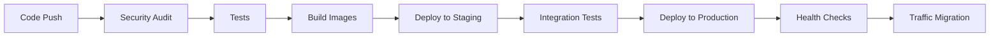

# Production Deployment Strategy for Pinky Promise App

## 🏗️ Overview

This document outlines the comprehensive production deployment strategy for the Pinky Promise application, focusing on reliability, security, scalability, and maintainability.

## 📋 Table of Contents

1. [Deployment Architecture](#deployment-architecture)
2. [Environment Strategy](#environment-strategy)
3. [CI/CD Pipeline](#cicd-pipeline)
4. [Security Strategy](#security-strategy)
5. [Monitoring & Observability](#monitoring--observability)
6. [Scaling Strategy](#scaling-strategy)
7. [Disaster Recovery](#disaster-recovery)
8. [Performance Optimization](#performance-optimization)
9. [Implementation Steps](#implementation-steps)

## 🏛️ Deployment Architecture

### Multi-Environment Setup
```
Development → Staging → Production
     ↓           ↓         ↓
   Local      Preview   Live Users
```

### Infrastructure Components

- **Compute**: Google Cloud Run (Serverless containers)
- **Database**: Cloud SQL PostgreSQL (Regional with HA)
- **Storage**: Cloud Storage for static assets
- **CDN**: Cloud CDN for global content delivery
- **Load Balancing**: Application Load Balancer
- **Monitoring**: Cloud Monitoring + Alerting
- **Security**: IAM, Secret Manager, Cloud Armor

## 🌍 Environment Strategy

### 1. Development Environment
- **Purpose**: Feature development and initial testing
- **Infrastructure**: Local Docker containers or Cloud Run (minimal resources)
- **Database**: Shared development Cloud SQL instance
- **Domain**: `dev.pinky-promise.example.com`

### 2. Staging Environment
- **Purpose**: Pre-production testing and QA
- **Infrastructure**: Cloud Run (production-like config)
- **Database**: Dedicated Cloud SQL instance
- **Domain**: `staging.pinky-promise.example.com`
- **Features**: Production data snapshots, performance testing

### 3. Production Environment
- **Purpose**: Live user traffic
- **Infrastructure**: Cloud Run (high availability)
- **Database**: Regional Cloud SQL with read replicas
- **Domain**: `pinky-promise.example.com`
- **Features**: Full monitoring, backups, security hardening

## 🔄 CI/CD Pipeline

### Pipeline Stages



### 1. Continuous Integration

**Triggered on**: Every pull request and main branch push

**Steps**:
1. **Security Scanning**: NPM audit, container vulnerability scanning
2. **Code Quality**: ESLint, Prettier, type checking
3. **Testing**: Unit tests, integration tests, coverage reports
4. **Build**: Docker image creation with multi-stage builds
5. **Push**: Images to Google Container Registry

### 2. Continuous Deployment

**Blue-Green Deployment Strategy**:
- Deploy new version alongside current version
- Gradually shift traffic (0% → 25% → 50% → 100%)
- Automatic rollback on health check failures
- Zero-downtime deployments

**Canary Releases**:
- Route 5% of traffic to new version initially
- Monitor key metrics for 30 minutes
- Proceed with full deployment if metrics are healthy

## 🔐 Security Strategy

### 1. Infrastructure Security

- **IAM**: Principle of least privilege
- **VPC**: Private networking with Cloud NAT
- **Firewall**: Restrictive ingress/egress rules
- **SSL/TLS**: Managed certificates with automatic renewal
- **DDoS Protection**: Cloud Armor with rate limiting

### 2. Application Security

- **Secrets Management**: Google Secret Manager
- **Authentication**: JWT with secure key rotation
- **Input Validation**: Comprehensive request sanitization
- **CORS**: Restrictive cross-origin policies
- **Security Headers**: HSTS, CSP, X-Frame-Options

### 3. Database Security

- **Private IP**: No public database access
- **Encryption**: At rest and in transit
- **Access Control**: Database-specific users with limited permissions
- **Audit Logging**: All database operations logged

### 4. Container Security

- **Base Images**: Minimal, distroless images
- **Vulnerability Scanning**: Automated with Container Analysis
- **Non-root Users**: Containers run as non-privileged users
- **Resource Limits**: CPU and memory constraints

## 📊 Monitoring & Observability

### 1. Application Metrics

- **Request Rate**: Requests per second
- **Response Time**: 95th percentile latency
- **Error Rate**: 4xx and 5xx error percentages
- **Throughput**: Successful requests per minute

### 2. Infrastructure Metrics

- **CPU Utilization**: Container and database CPU usage
- **Memory Usage**: Container memory consumption
- **Database Performance**: Connection count, query performance
- **Network**: Ingress/egress traffic patterns

### 3. Business Metrics

- **User Registrations**: New user sign-ups
- **Active Users**: Daily/monthly active users
- **Feature Usage**: Core feature adoption rates
- **Conversion Rates**: Key business objectives

### 4. Alerting Strategy

- **Critical Alerts**: Immediate notification (SMS/Phone)
  - Application completely down
  - Database connection failures
  - Security incidents

- **Warning Alerts**: Email notifications
  - High error rates (>1%)
  - Increased latency (>2s)
  - Resource utilization (>80%)

- **Info Alerts**: Dashboard notifications
  - Deployment completions
  - Scaling events
  - Backup completions

## 📈 Scaling Strategy

### 1. Horizontal Scaling

**Cloud Run Auto-scaling**:
- **Min Instances**: 2 (for availability)
- **Max Instances**: 100 (cost protection)
- **Concurrency**: 100 requests per instance
- **Scale Triggers**: CPU >70%, Memory >80%

### 2. Database Scaling

**Vertical Scaling**:
- **Production**: db-custom-4-8192 (4 vCPU, 8GB RAM)
- **Scaling Triggers**: CPU >60%, Memory >70%

**Read Replicas**:
- **Count**: 2 read replicas in different zones
- **Usage**: Analytics queries, reporting

### 3. CDN and Caching

- **Cloud CDN**: Global edge caching
- **Cache Strategy**: Static assets (1 year), API responses (5 minutes)
- **Cache Invalidation**: Automated on deployments

## 🚨 Disaster Recovery

### 1. Backup Strategy

**Database Backups**:
- **Frequency**: Automated daily backups at 2 AM UTC
- **Retention**: 30 days for daily, 12 months for monthly
- **Point-in-time Recovery**: 7-day window
- **Cross-region Replication**: Backup to different region

**Application Backups**:
- **Container Images**: Immutable, versioned in registry
- **Configuration**: Infrastructure as Code in Git
- **Secrets**: Versioned in Secret Manager

### 2. Recovery Procedures

**RTO (Recovery Time Objective)**: 4 hours
**RPO (Recovery Point Objective)**: 1 hour

**Incident Response**:
1. **Detection**: Automated monitoring alerts
2. **Assessment**: Incident severity classification
3. **Response**: Automated failover or manual intervention
4. **Communication**: Status page updates
5. **Recovery**: Service restoration and validation
6. **Post-mortem**: Root cause analysis and improvements

## ⚡ Performance Optimization

### 1. Application Performance

- **Code Optimization**: Regular performance profiling
- **Database Queries**: Index optimization, query analysis
- **Caching**: Application-level caching with Redis
- **Compression**: Gzip compression for API responses

### 2. Frontend Performance

- **Bundle Optimization**: Code splitting, lazy loading
- **Image Optimization**: WebP format, responsive images
- **PWA Features**: Service workers, offline capabilities
- **Critical CSS**: Above-the-fold content optimization

### 3. Infrastructure Performance

- **Global Distribution**: Multi-region deployment
- **Edge Caching**: CDN with smart routing
- **Database Optimization**: Connection pooling, query optimization
- **Resource Right-sizing**: Regular capacity planning

## 🚀 Implementation Steps

### Phase 1: Infrastructure Setup (Week 1)

1. **Run production setup script**:
   ```bash
   chmod +x deploy/production-setup.sh
   ./deploy/production-setup.sh
   ```

2. **Configure monitoring**:
   ```bash
   chmod +x deploy/monitoring-setup.sh
   ./deploy/monitoring-setup.sh
   ```

3. **Set up custom domain and SSL certificates**
4. **Configure CDN and load balancer**

### Phase 2: CI/CD Pipeline (Week 2)

1. **Set up Cloud Build triggers**:
   ```bash
   gcloud builds triggers create github \
     --repo=your-username/pinky-promise-app \
     --branch-pattern="^main$" \
     --build-config=deploy/cloudbuild-production.yaml
   ```

2. **Configure branch protection rules**
3. **Set up automated testing pipeline**
4. **Implement deployment approval process**

### Phase 3: Security Hardening (Week 3)

1. **Enable Cloud Armor WAF**
2. **Configure VPC and private networking**
3. **Implement comprehensive logging**
4. **Set up security scanning automation**
5. **Conduct security audit**

### Phase 4: Monitoring & Alerting (Week 4)

1. **Configure all monitoring dashboards**
2. **Set up alerting rules and notification channels**
3. **Implement SLO monitoring**
4. **Create runbooks for common incidents**
5. **Test disaster recovery procedures**

### Phase 5: Performance Optimization (Ongoing)

1. **Implement performance monitoring**
2. **Optimize database queries and indexes**
3. **Set up automated performance testing**
4. **Regular capacity planning reviews**

## 📋 Production Checklist

### Pre-Deployment
- [ ] All tests passing (unit, integration, e2e)
- [ ] Security scans completed
- [ ] Performance benchmarks met
- [ ] Database migrations tested
- [ ] Rollback plan prepared
- [ ] Monitoring dashboards configured
- [ ] Alert channels tested

### Post-Deployment
- [ ] Health checks passing
- [ ] Key metrics within expected ranges
- [ ] User acceptance testing completed
- [ ] Performance monitoring active
- [ ] Backup verification completed
- [ ] Documentation updated

## 🔗 Quick Start Commands

```bash
# Set up production infrastructure
chmod +x deploy/production-setup.sh && ./deploy/production-setup.sh

# Configure monitoring and alerting
chmod +x deploy/monitoring-setup.sh && ./deploy/monitoring-setup.sh

# Deploy using production CI/CD pipeline
gcloud builds submit --config=deploy/cloudbuild-production.yaml

# Monitor deployment status
gcloud run services list --region=us-central1

# View application logs
gcloud logging read "resource.type=cloud_run_revision" --limit=50
```

## 📚 Additional Resources

- [Google Cloud Run Best Practices](https://cloud.google.com/run/docs/best-practices)
- [Cloud SQL Production Checklist](https://cloud.google.com/sql/docs/mysql/production-checklist)
- [GCP Security Best Practices](https://cloud.google.com/security/best-practices)
- [Site Reliability Engineering (SRE) Practices](https://sre.google/sre-book/table-of-contents/)

---

**Next Steps**: Begin with Phase 1 infrastructure setup and gradually implement each phase while maintaining existing functionality.

